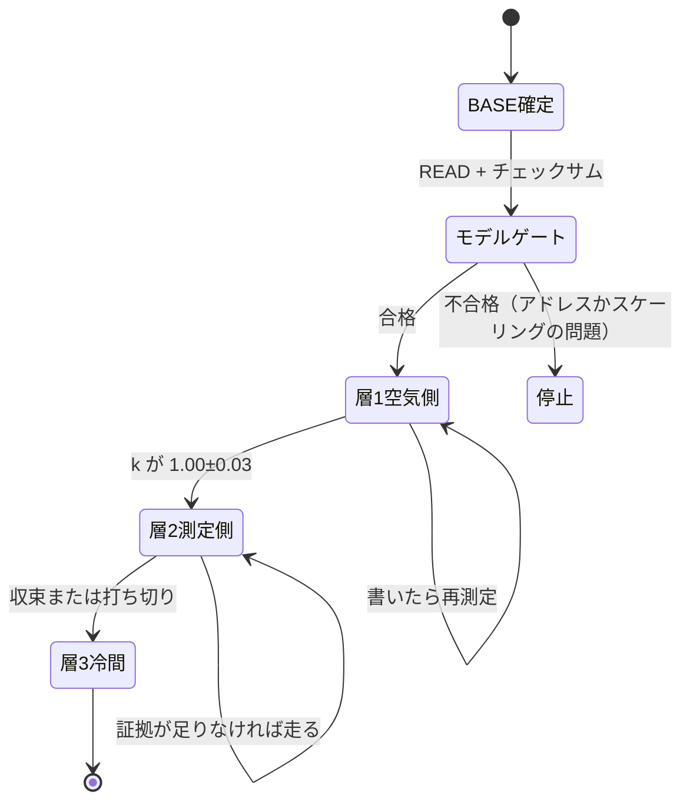

# 68 — 自動化したときのユーザー体験

`67-tuning-procedure.md` は「人間が手で何をするか」を書いた。この文書は
**それをツールが担ったとき、ユーザーの操作がどうなるか**を書く。

前提知識は 67 の第 1 部（DME の 2 つの仕事）だけでよい。

---

# 第 1 部 — 「VE」と「LOW LOAD」は 2 つのモードではない

## 1.1 同じ 1 枚の表の、違う領域である

`kf_rf_soll`（`0xD356`、24 行 × 20 列）は **1 枚しかない**。
VE と LOW LOAD は別々のテーブルではなく、**この 1 枚の違う領域を、違う規則で導いている**。

```
kf_rf_soll  24行 × 20列
┌──────────────────────────────────────────────┐
│ 行 0    aq_rel_rf 0.098 %   到達しない（サンプルが入らない） │
├──────────────────────────────────────────────┤
│ 行 1–12  0.146 – 3.198 %    ← LOW LOAD の規則              │
│                              アイドル・超低負荷            │
├──────────────────────────────────────────────┤
│ 行 13–19  5.0 – 30.0 %      ← VE の規則                    │
│                              巡航・中負荷                  │
├──────────────────────────────────────────────┤
│ 行 20–23  45 – 100 %        ← 全負荷域。λ が開く           │
└──────────────────────────────────────────────┘
```

## 1.2 なぜ規則が違うのか

**式は同じである。違うのは、どれだけの証拠を要求するかだけ。**

| | LOW LOAD（行 1–12） | VE（行 13–19） |
|---|---|---|
| 補正式 | `トリム（STFT × LTFT）× rf_korr` | **同一** |
| 必要サンプル数 | **30**（1 升あたり） | 10 |
| 必要な独立訪問 | **2 回**（5 秒以上あける） | — |
| セルの幅 | 0.05 % 開度 | 5 % 開度 |
| 変化量の上限 | +8 % / −5 %（下げ側を小さく＝薄いは失火） | — |

**低開度の基準が厳しいのは、λ 制御が 2 点制御だからである。**
`la_f_regler` は 1–2 Hz のリミットサイクルを持ち、DS2 のサンプルレートは 3–5 Hz。
30 サンプルは「1 周期を 30 点で見た」だけかもしれない。信号待ち 1 回は 1 観測であって
30 観測ではない。だから **サンプル数ではなく訪問数で数える**。

## 1.3 したがってユーザーは「モード」を選ばない

**ユーザーがすることは、走ることだけである。**
1 回の走行には、アイドルのサンプルも、超低負荷のサンプルも、巡航のサンプルも入っている。
ツールは各サンプルの `aq_rel_rf` を計算し、**どの升に落ちるかで自動的に規則を選ぶ。**

```
サンプルが到着
   ↓
aq_rel_rf = rawLoad / kl_aq_rel_rf_fakt(rpm)
   ↓
   ├─ 行 0 に落ちる          → 捨てる（触らない領域）
   ├─ 行 1–12 に落ちる       → LOW LOAD の器へ（訪問も記録）
   ├─ 行 13–19 に落ちる      → VE の器へ
   └─ 行 20–23 に落ちる      → 全負荷域。λ が開いていれば捨てる
```

**「VE タブ」と「LOW LOAD タブ」は、同じ表の違う領域の“見え方”である。**
どちらを開いていても、走っているログは 1 本、集まっている証拠は 1 組である。

---

# 第 2 部 — 3 つの層と、順番が決まっている理由

| 層 | 表 | 何を直すか | 判定に使うもの |
|---|---|---|---|
| **層 1 空気側** | `KF_LLS_TV`（`0x9E10`） | バルブが実際に流す量 | `ML_SOLL_LLS` と `RF` |
| **層 2 測定側** | `kf_rf_soll`（`0xD356`） | 開度から充填を見積もる表 | λ トリム |
| **層 3 冷間** | `kf_rf_soll_kath`（`0xD770`） | 触媒暖機中の同じ見積もり | λ トリム＋ブレンド係数 |

## 2.1 層 1 を書くと、層 2 の証拠が全部無効になる

バルブの開度が変われば `AQ_REL` が変わり、`aq_rel_rf` が変わり、
**アイドルが `kf_rf_soll` の別の升へ移動する。**

```
KF_LLS_TV を書く
   ↓ バルブのデューティが変わる
   ↓ AQ_ABS_LLS が変わる
   ↓ AQ_REL が変わる
   ↓ aq_rel_rf が変わる
   ↓ アイドルが別の升に乗る
   ↓
それまでに集めた低開度の証拠は「もう使わない升の証拠」になる
```

**だから自動化の中心は、補正の計算ではなく「証拠の失効管理」である。**
ツールは、どの証拠がどの BASE に対して取られたかを覚えていて、
層 1 が書かれた瞬間に層 2 の証拠を無効にしなければならない。

## 2.2 層 2 の中では VE と LOW LOAD は同時でよい

同じ層の中で領域が違うだけなので、**衝突しない。**
1 回の走行が両方に証拠を供給する。片方だけ基準を満たしたら、片方だけ書ける。

---

# 第 3 部 — 画面で何が起きるか

## 3.1 キャンペーン — 作業の単位

**キャンペーン**は「1 つの BASE から始まり、次のフラッシュで終わる」ひとまとまりの作業である。

```
BASE を車から READ
   ↓
キャンペーン開始
   ↓
   走る → 証拠が溜まる → 走る → 証拠が溜まる …
   ↓
書ける状態になったものを武装して WRITE
   ↓
フラッシュ → 読み返し → 適応クリア
   ↓
次のキャンペーンが、その READ から始まる
```

画面上部に常時 1 行:

```
CAMPAIGN 3   BASE 1F4A2C…   層 2（測定側）   走行 4 本 / 2h 18m   採択 11 升
```

## 3.2 フェーズ表示 — 今どこにいて、何が足りないか



**フェーズは飛ばせない。** 層 1 が未確定のまま層 2 の WRITE を武装しようとすると、
ハブは理由を出して拒否する:

```
WRITE できません
  層 1（空気側）が未確定です。KF_LLS_TV を書くと、
  いま集めた 11 升の証拠は無効になります。
  → 先にアイドル 3 分を録ってください
```

## 3.3 カバレッジ・マップ — 画面の中心

**`kf_rf_soll` の 24 × 20 を 1 枚で出す。** 升の色が証拠の状態を表す。

| 見え方 | 意味 | タップすると |
|---|---|---|
| 無地 | サンプルなし | 「この升に到達する運転」を出す |
| 枠だけ | サンプルはあるが基準未達 | `12/30 サンプル・訪問 1/3` |
| 点灯（青） | 採択・補正は薄くする方向 | `0.200 → 0.198（−1.0 %、2 カウント）` |
| 点灯（赤） | 採択・補正は濃くする方向 | 同上 |
| 斜線 | **触らない領域**（行 0、および全負荷域） | 理由を出す |
| 二重枠 | いま車がいる升（ライブ中のみ） | — |

行 12（3.198 %）と行 13（5.005 %）の間に **LOW LOAD / VE の境界線**を引く。
どちらの規則が適用されたかは、升の色ではなく**境界線の位置**で分かるようにする ——
色は補正の向きに使い切っているし、規則の違いは領域で決まるので線で足りる。

## 3.4 「次に何を走るか」 — 自動化の核心

**足りない升を、運転の指示に翻訳する。** これがツールが人間の代わりにやる最大のことである。

```
次に必要な走行

  ① アイドル 3 種   [ 未取得 ]                        約 10 分・停車
     行 3–6 × 600–1100 rpm が空いています
     暖機後、N レンジで
       A/C OFF 15 秒 → A/C ON 15 秒 → OFF 15 秒     ×3
       ステアリング据え切り 15 秒 → 戻す 15 秒        ×3
       ヘッドライト＋デフォッガ＋ブロワ最大 15 秒     ×3
     各状態のあいだは 5 秒以上あけてください（訪問として数えるため）

  ② 超低負荷巡航   [ 訪問 1/3 ]                      約 15 分・走行
     行 7–12 × 1300–2400 rpm が薄いです
     6 速・緩い下り坂・一定スロットルで 15 秒保持 ×3
     速度は 50 / 70 / 90 km/h の 3 点

  ③ 中負荷巡航     [ 採択済み ]                      —

  ④ 全負荷         [ 導出不可 ]
     行 20–23（45 % 以上）は全負荷域です。λ 制御は `KF_BZ_WDK_VL` で
     停止するので、トリムからは導けません。
     この領域は RF KORR と WOT のワークフローが担当します。
     （λ が実際にどこで開くかはスロットル開度で決まるので、行では決まりません。
       境界はログの `stft` が消える点として実測してください。）
```

**「導出不可」を黙って空欄にしないこと。** 空欄は「まだ走っていない」に見え、
ユーザーは永久に埋まらない領域を追いかけることになる。

## 3.5 ライブ中に見えるもの

走行中は、いま何が起きているかを 1 行で:

```
● REC   1,842 pts   3.9 Hz        いま: 1600 rpm × 1.62 %  →  行 10 × 列 5
                                  この升 22/30 サンプル・訪問 2/3
                                  ▸ あと 8 サンプル。そのまま保持
```

保持が足りたら:

```
                                  ✓ この升は取れました。一度別の状態へ移ってください
```

**「一度離れろ」と言えることが重要である。** 訪問は 5 秒以上の間隔で数えるので、
同じ状態を 60 秒保持しても訪問は 1 のままになる。ユーザーがこれを知らないと、
「30 サンプル取ったのに採択されない」という不可解な状態に落ちる。

## 3.6 WRITE マニフェスト — 何が武装できるか

ハブの WRITE メニューは、**各項目の可否と理由**を出す:

```
WRITE
  ☑ VE                    採択 8 升 / 480          最大 −2.1 %
  ☑ LOW LOAD              採択 3 升 / 240          最大 −1.0 %
  ☐ IDLE VALVE            k = 1.15（要 3 分アイドル）
  ☐ COLD MAP              冷間ログ 0/3
  ☐ RF KORR               証拠なし（V > 20 km/h の走行が必要）
```

トグルを入れると、ハブの WRITE ボタンの下に項目名が並ぶ。
**VE と LOW LOAD は同時に武装できる。** 同じ表の違う領域なので衝突しない ——
`composeVeGrid` が升ごとに所有者を決める:

```
LOW LOAD が測定/修復した升  → LOW LOAD の値
VE が採択した升              → VE の値
どちらも触っていない升        → BASE のまま
両方 OFF                     → 表に 1 バイトも触れない
```

## 3.7 フラッシュ後にツールがやること

```
WRITE → ファイル生成
   ↓
フラッシュ（初回は必ず FULL VERIFY）
   ↓
自動で読み返し、書いたバイトを照合
   ↓
「適応をクリアしますか？」 ← 必ず聞く
   ↓ はい
TUNE_ADAPTATION_CLEAR + VANOS_ADAPTATION_CLEAR
   ↓
新しいキャンペーンを、この READ から分岐して開始
   ↓
前キャンペーンの証拠は「BASE が違う」として自動的に無効化
```

**適応クリアを聞くのは省略できない。** `MD_LLRA` は不揮発なので、クリアしないと
次の層 1 測定はフラッシュ前の学習値を読む。

---

# 第 4 部 — 実際の操作を時系列で

**層 1 の測定は 1 回の整定アイドルで済む**（`k` は 1 本の走行から出る）。
`MD_LLRA` はその符号のクロスチェックであり、書いたあとの確認に使う。

| | やること | 所要 | ツールの状態 |
|---|---|---|---|
| **1 日目** | 車から READ、チェックサム確認 | 5 分 | キャンペーン開始・層 0 |
| | 暖機後アイドル 3 分 | 3 分 | **モデルゲート合格** → 層 1 へ |
| | 同じログから `k` を計算 | 自動 | `k = 1.15` → IDLE VALVE が武装可能に |
| | WRITE（IDLE VALVE のみ）→ フラッシュ → 適応クリア | 20 分 | 新キャンペーン・層 1 検証待ち |
| **2〜4 日目** | 普通に乗る（始動 → 暖機 → 停止 を数回） | — | `MD_LLRA` が 0 へ寄るのを確認 |
| **5 日目** | 暖機後アイドル 3 分 | 3 分 | `k = 1.02` → **層 1 確定**、層 2 へ |
| | アイドル 3 種（§3.4 の ①） | 10 分 | LOW LOAD の行 3–6 が埋まる |
| | 超低負荷 + 中負荷の巡航 | 40 分 | VE と LOW LOAD が同時に埋まる |
| | WRITE（VE + LOW LOAD）→ フラッシュ | 20 分 | 新キャンペーン |
| **6 日目〜** | 冷間始動を録る（別の日に 3 回） | 各 15 分 | 層 3 |

**この車の現状では、5 日目の WRITE は「書くものがない」で終わる可能性が高い。**
暖機後アイドルの補正量は 0.9 %（量子化 2 段）だからである。ツールはそれを
**「収束」として緑で出す**べきで、空欄にしてはいけない。

---

# 第 5 部 — 同時に走らせるときに起きること

## 5.1 升の所有権 — 境界での衝突

行 12（3.198 %）と行 13（5.0 %）の境界で、両方の規則がサンプルを拾いうる。
**所有権は升単位で決まり、LOW LOAD が優先する** —— 式は VE と同じ（トリム × `rf_korr`）だが、
行 12 以下の升は VE 側が `out-of-band` として棄却するので（`veOwnsRow = r > LOW_LOAD_TOP_ROW`、
`calculator.ts:616`）、この帯を通せる証拠ゲートを持っているのは LOW LOAD だけだからである。

```
if (LOW LOAD がこの升を測定/修復した)  → LOW LOAD の値
else if (VE がこの升を採択した)         → VE の値
else                                    → BASE のまま
```

## 5.2 証拠の失効 — 何がいつ無効になるか

| 出来事 | 無効になるもの |
|---|---|
| `KF_LLS_TV` を書いた | **層 2 の証拠すべて**（升が動く） |
| 目標アイドル回転を変えた | **層 2 の証拠すべて** ＋ `MD_LLRA` の学習 |
| `kf_rf_soll` を書いた | その升の証拠のみ（次の反復では新しい値が基準） |
| 別の BASE のログを読み込んだ | そのログすべて（系譜が違う） |
| フラッシュした | 全部（新しいキャンペーンになる） |

**ツールはこれを黙ってやってはいけない。** 失効させるときは、何が失われるかを先に言う:

```
KF_LLS_TV を書くと、いま採択されている 11 升の証拠が無効になります
（VE 8 升・LOW LOAD 3 升、走行 4 本ぶん）

  ▸ 先に VE と LOW LOAD を書いてから、空気側に進む
  ▸ 空気側を先に書いて、測定側は録り直す        ← 推奨
```

**推奨は「空気側が先」である。** 層 1 が動けば層 2 は必ずやり直しになるので、
先に層 2 を書いても捨てることになる。

## 5.3 部分適用 — 片方だけ書ける

VE が基準を満たし LOW LOAD が満たしていない（あるいはその逆）は普通に起きる。
**満たしたほうだけ武装できる。** 満たしていないほうは理由が出る:

```
☐ LOW LOAD    採択 0 升
              行 3: 訪問 1/3（サンプルは 84 ある）
              → 同じ状態を保持し続けています。一度別の状態へ移ってください
```

---

# 第 6 部 — 誰が何を決めるか

| | 決める人 | なぜ |
|---|---|---|
| 目標アイドル回転 | **ユーザー** | データは「何 rpm であるべきか」を教えない。好みである |
| どの層まで進むか | **ユーザー** | 冷間まで追うかどうかは手間との相談 |
| 書くか書かないか | **ユーザー** | すべてトグル。既定は OFF |
| どこで止めるか | **ユーザー**（ツールは提案する） | 収束・発散・打ち切りの区別はツールが出す |
| どの升に証拠が足りないか | **ツール** | 数えるだけ。人間がやる意味がない |
| 補正量 | **ツール** | 式は決まっている |
| どの規則を適用するか | **ツール** | `aq_rel_rf` で決まる |
| 証拠の失効 | **ツール**（ユーザーに宣言してから） | 人間が追える情報量ではない |
| 順序の強制 | **ツール** | 順序を破ると静かに間違うので、止めるべき |

**「ツールが決める」ものはすべて、根拠を出せなければならない。**
採択された升をタップしたら「何サンプル・何訪問・トリクいくつ・だから何倍」が出る。
出せない自動化は、ユーザーが検算できないので信用できない。

---

# 付録 — 今のアプリとの差分

いま揃っているもの:

- 1 枚の表への単一書き込み点（`composeVeGrid`）と升単位の所有権
- VE / LOW LOAD それぞれの証拠ゲート（サンプル数・訪問・分散・スプレッド）
- ハブの WRITE / RESTORE / PATCH マニフェストとトグル（既定 OFF）
- モデルゲート（`evaluateModelGate`）—— ただしライブラリと検査だけで、画面に出ていない
- 系譜（どの BASE のログか）の記録
- `IDLE` プロファイルは層 1 の測定に必要な列をすべて読んでいる
- フラッシュの FULL / QUICK 検証ポリシーと適応クリアのダイアログ

足りないもの:

| | 何が要るか |
|---|---|
| **キャンペーンという単位** | 層とフェーズの状態を持ち、進行を 1 行で出す |
| **カバレッジ・マップ** | いまは VE と LOW LOAD が別画面。**1 枚に統合する**のがこの UX の中心 |
| **「次に何を走るか」** | 空いている升 → 運転指示への翻訳。この文書 §3.4 の表がその仕様 |
| **ライブの升フィードバック** | 「いまこの升・訪問 2/3・一度離れて」 |
| **証拠の失効の宣言** | いま失効は暗黙。§5.2 のダイアログが要る |
| **モデルゲートの画面** | 合否と理由を出す。いまは検査スクリプトの中だけ |
| **層 1 の書き込み経路** | `KF_LLS_TV` を書く手段が無い |
| **層 3 の書き込み経路** | `kf_rf_soll_kath`（`0xD770`）を書く手段が無い |
| **収束と証拠ゼロの区別** | いまはどちらも「空の出力」。棄却理由の内訳から終端を判定する |
| ~~**LOW LOAD のアイドル帯の解錠**~~ | **解消済み。** 補正式から `TI_F_STAT` が外れ、`requireTiBranchProven` も既定 OFF になった。いまアイドル帯の升を止めているのは証拠ゲート（サンプル数・訪問・分散・標準誤差）だけである |
